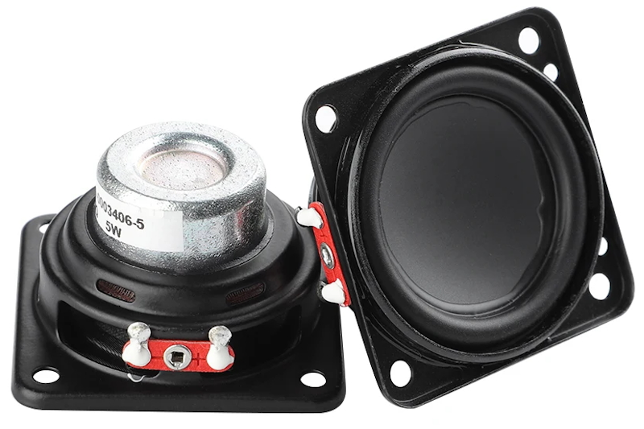

# JBL-Flip-3-Emulator

## Overview

Welcome to the github repository of my JBL Flip 3 emulator project. The aim of this project is to reproduce the tactile and sonic experience of this iconic portable speaker using both hardware and software developed by myself.

Technical aspects:
* **Hardware**: battery charge management and voltage conversion to power an ESP32, which handles Bluetooth functionality as well as the various buttons and LEDs.

* **Software**: I use the Espressif audio development framework to develop a complete firmware. This controls volume, emits sounds for various actions and generates an audio stream via I2S communication between the ESP32 and a MAX98357 amplifier.

The system is modularly designed for ease of repair and maximum durability. I also took care to reuse components I already had in stock.
I'd like to thank Adafruit, my main source of inspiration, notably through their “Aluminum Mounting Grid”, of which I printed a 3D copy with my Ender3, as well as for their excellent modules whose standard format I used.
Please don't hesitate to contact me if you have any questions.
